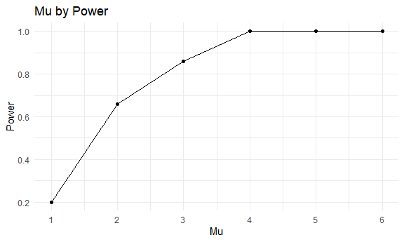
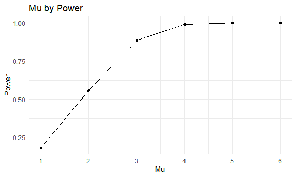

Homework 5
================
Ashwini Varghese
2022-11-16

## Problem 1:

## Problem 2:

``` r
homicides = read.csv("./homicide-data.csv")
```

The raw dataset `homicides` contains 12 variables and 52179
observations. It describes information on homicides from 50 large US
cities. Variables of interest include the case ID, the date of the
incident, information on the victim (name, race, age and sex),
information on the location of the homicide, and the disposition of the
case.

We will create a new variable `city_state`.

``` r
new_homi <- homicides %>%
  unite("city_state", city:state, sep = ", ", remove = FALSE)
```

We will first look at the total number of homicides in a city and then
at the number of homicides that are unsolved in a city.

``` r
new_homi %>% 
  group_by(city) %>%
  summarize(count = n()) %>%
  knitr::kable(digits = 1)
```

| city           | count |
|:---------------|------:|
| Albuquerque    |   378 |
| Atlanta        |   973 |
| Baltimore      |  2827 |
| Baton Rouge    |   424 |
| Birmingham     |   800 |
| Boston         |   614 |
| Buffalo        |   521 |
| Charlotte      |   687 |
| Chicago        |  5535 |
| Cincinnati     |   694 |
| Columbus       |  1084 |
| Dallas         |  1567 |
| Denver         |   312 |
| Detroit        |  2519 |
| Durham         |   276 |
| Fort Worth     |   549 |
| Fresno         |   487 |
| Houston        |  2942 |
| Indianapolis   |  1322 |
| Jacksonville   |  1168 |
| Kansas City    |  1190 |
| Las Vegas      |  1381 |
| Long Beach     |   378 |
| Los Angeles    |  2257 |
| Louisville     |   576 |
| Memphis        |  1514 |
| Miami          |   744 |
| Milwaukee      |  1115 |
| Minneapolis    |   366 |
| Nashville      |   767 |
| New Orleans    |  1434 |
| New York       |   627 |
| Oakland        |   947 |
| Oklahoma City  |   672 |
| Omaha          |   409 |
| Philadelphia   |  3037 |
| Phoenix        |   914 |
| Pittsburgh     |   631 |
| Richmond       |   429 |
| Sacramento     |   376 |
| San Antonio    |   833 |
| San Bernardino |   275 |
| San Diego      |   461 |
| San Francisco  |   663 |
| Savannah       |   246 |
| St. Louis      |  1677 |
| Stockton       |   444 |
| Tampa          |   208 |
| Tulsa          |   584 |
| Washington     |  1345 |

``` r
new_homi %>% 
  filter(disposition %in% c("Closed without arrest", "Open/No arrest")) %>%
  group_by(city) %>%
  summarize(count = n()) %>%
  knitr::kable(digits = 1)
```

| city           | count |
|:---------------|------:|
| Albuquerque    |   146 |
| Atlanta        |   373 |
| Baltimore      |  1825 |
| Baton Rouge    |   196 |
| Birmingham     |   347 |
| Boston         |   310 |
| Buffalo        |   319 |
| Charlotte      |   206 |
| Chicago        |  4073 |
| Cincinnati     |   309 |
| Columbus       |   575 |
| Dallas         |   754 |
| Denver         |   169 |
| Detroit        |  1482 |
| Durham         |   101 |
| Fort Worth     |   255 |
| Fresno         |   169 |
| Houston        |  1493 |
| Indianapolis   |   594 |
| Jacksonville   |   597 |
| Kansas City    |   486 |
| Las Vegas      |   572 |
| Long Beach     |   156 |
| Los Angeles    |  1106 |
| Louisville     |   261 |
| Memphis        |   483 |
| Miami          |   450 |
| Milwaukee      |   403 |
| Minneapolis    |   187 |
| Nashville      |   278 |
| New Orleans    |   930 |
| New York       |   243 |
| Oakland        |   508 |
| Oklahoma City  |   326 |
| Omaha          |   169 |
| Philadelphia   |  1360 |
| Phoenix        |   504 |
| Pittsburgh     |   337 |
| Richmond       |   113 |
| Sacramento     |   139 |
| San Antonio    |   357 |
| San Bernardino |   170 |
| San Diego      |   175 |
| San Francisco  |   336 |
| Savannah       |   115 |
| St. Louis      |   905 |
| Stockton       |   266 |
| Tampa          |    95 |
| Tulsa          |   193 |
| Washington     |   589 |

`prop.test`

``` r
new_homi %>%
  filter(city_state == "Baltimore, MD") %>%
  summarize(count = n())
```

    ##   count
    ## 1  2827

``` r
new_homi %>%
  filter(city_state == "Baltimore, MD") %>%
  filter(disposition %in% c("Closed without arrest", "Open/No arrest")) %>%
  summarize(count = n())
```

    ##   count
    ## 1  1825

From the above code, we see that in the city of Baltimore, MD, there
were a total of 2827 homicides and of those homicides, 1825 were
unsolved. We can use `prop.test` to estimate the proportion of homicides
that are unsolved and its confidence interval.

``` r
Balt_test <- prop.test(1825, 2827) %>%
  broom::tidy() %>%
  select(estimate, starts_with("conf"))
```

The proportion of homicides that are unsolved is 0.646 with a confidence
interval of 0.628 and 0.663.

Now we will create a function to do this for all the cities in the
dataset:

``` r
homi_nest =
  new_homi %>% 
  relocate(city_state) %>% 
  nest(data = uid:disposition)

prop = function(df) {

  data_result = df %>% 
    summarize(total = n(),
              unsolved = sum(disposition %in% c("Closed without arrest", "Open/No arrest")))
    
  prop_results = 
    prop.test(x = data_result %>% pull(unsolved), 
              n = data_result %>% pull(total))

  return(prop_results)
}


final <- homi_nest %>% 
  mutate(results = map(data, prop),
         estimates = map(results, broom::tidy)) %>% 
  select(city_state, estimates) %>% 
  unnest(estimates) %>%
  select(city_state, estimate, starts_with("conf"))


final %>% 
  filter(city_state != "Tulsa, AL") %>% 
  mutate(city_state = fct_reorder(city_state, estimate)) %>% 
  ggplot(aes(x = city_state, y = estimate)) + 
    geom_line() +
    geom_point()+
    geom_errorbar(aes(ymin = conf.low, ymax = conf.high), width=.2,
                 position=position_dodge(0.05))+
    theme(axis.text.x = element_text(angle = 90))
```

    ## geom_path: Each group consists of only one observation. Do you need to adjust
    ## the group aesthetic?


The above plot shows the proportion of unsolved homicides in each city
with its corresponding confidence interval. There was an error in the
data where Tulsa, AL was incorrected entered for Tulsa, OK. Instead of
completely removing it from the dataset, I filtered it out of the plot.

## Problem 3:

``` r
#rnorm(n = 30, mean = 0, sd = 5)

#rerun(5000, rnorm(n = 30, mean = 0, sd = 5))

sims = function(mu) {
  
  tibble_df = 
    tibble(x = rnorm(n = 30, mean = mu, sd = 5))
    t.test(tibble_df) %>% 
    broom::tidy() %>% 
    select(estimate, p.value)
}

just_zero = 
expand.grid(mu = 0, run = 1:50) %>% 
  mutate(value = map(mu, sims)) %>%
  unnest(value)
```

``` r
all_sims = 
expand.grid(mu = c(1:6), run = 1:50) %>% 
  mutate(value = map(mu, sims)) %>%
  unnest(value)
```

``` r
final_set <- 
  all_sims %>%
  mutate(conclusion = if_else(p.value > 0.05, "Do not reject null", "Reject null")) %>%
  group_by(mu, conclusion) %>%
  summarise(n = n()) %>% 
  mutate(power = n/sum(n)) %>%
  filter(conclusion == "Reject null") %>% 
  select(mu, power)
```

    ## `summarise()` has grouped output by 'mu'. You can override using the `.groups`
    ## argument.

``` r
power_plot =
  final_set %>%   
  ggplot(aes(x = mu, y = power)) +
  geom_line() +
  geom_point() +
  labs(
    title = "Mu by Power",
    x = "Mu",
    y = "Power"
  ) +
    scale_x_continuous(
    breaks = c(1, 2, 3, 4, 5, 6))

power_plot
```



``` r
avg_mu <-   
  all_sims %>%
  group_by(mu) %>%
  summarize(avg_mu = mean(estimate)) %>%
  mutate(data = "Null not rejected")

plot2 = 
  avg_mu %>%
  ggplot(aes(x = mu, y = avg_mu)) +
  geom_point() +
  geom_line() +
  labs(
    title = "Mu by Average Mu",
    x = "Mu",
    y = "Average of Mu"
  ) +
    scale_x_continuous(
    breaks = c(1, 2, 3, 4, 5, 6))

plot2
```



``` r
only_rejections <- 
  all_sims %>%
  mutate(conclusion = if_else(p.value > 0.05, "Do not reject null", "Reject null")) %>% 
  filter(conclusion == "Reject null") %>% 
  group_by(mu) %>%
  summarize(avg_mu = mean(estimate)) %>%
  mutate(data = "Null rejected")


plot3 <-   
  only_rejections %>%
  ggplot(aes(x = mu, y = avg_mu)) +
  geom_point() +
  geom_line() +
  labs(
    title = "Mu by Average Mu for Rejected Nulls",
    x = "Mu",
    y = "Average of Mu"
  ) +
    scale_x_continuous(
    breaks = c(1, 2, 3, 4, 5, 6))

plot3
```


As we can see from the plot, as the true mu gets higher, the average mu
of the tests where the null is rejected gets closer to the true mu as
opposed to when the mu is smaller.
